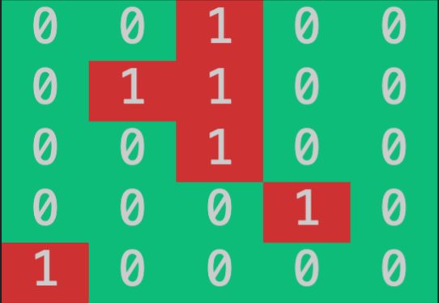
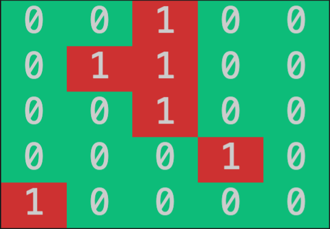
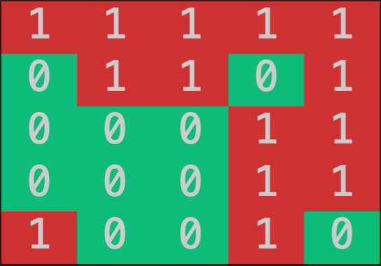

# PANDEMIC SIMULATOR :mask: :microbe:
Technical interview practice, an assignment given by aNewSpring.
This is a practice technical interview simulation provided by Codam. The assignment is to be coded in Java. This is my first time writing code in Java, so it might be a bit messy. :innocent:

### Assignment :memo:
The current pandemic is of course all over the news these days. Trying to get it under control requires the right information and one of the key pieces of information is how the virus spreads. In order to investigate this, simulations of the spread of the virus are used. 

The mission is to build a simulation (using JAVA) that models this spread on a grid of n*n persons. The simulation, running over the course of a number of iterations, or “rounds”, will be based on the simple assumption that the virus spreads through contact between adjacent people. If the number of contacts reaches a certain threshold, a person will become infected. When an infected person is surrounded by more than a certain threshold of infected people, the virus will die out and that person will recover and become uninfected again.


For example, a simulation on an 8x8 grid, with 7 rounds, an infection threshold of 3, a recovery threshold of 6 and 3 infected persons to start with can be run with a command similar to the following:

`java pandemic 8 7 3 6 [<4,7>,<4,8>,<5,8>]`

After a number of rounds the output should be displayed.

```
> program name: pandemic
> 1st parameter: n * n grid: 8
> 2nd parameter: numer of rounds: 7
> 3rd parameter: infection threshold: 3
> 4th parameter: recovery threshold: 6
> 5th parameter: coordinates infected people: `[<4,7>,<4,8>,<5,8>]`
```

### Input Handling :pencil2:
Seeing I can't figure out how to read the coordinates as argmuments I choose to add double quotes to the last argument so that I am able to parse through it as a string `"[<4,7>,<4,8>,<5,8>]"`.
So the input I will be working with will be : `java pandemic 8 7 3 6 "[<4,7>,<4,8>,<5,8>]"`

### Error checking :no_entry:
Trying to make the model fit the real world, I inplied the following error checks. The program will exit if:
- An incorrect amount of arguments is passed.
- An argument is passed as 0 or negative. 
- The grid is smaller than 2.
- An coordinate is outside of the grid.
- The infection rate is bigger then the number of possible neighbors.

### Rules :scroll:
The spread of the pandemic is covered by a limited set of rules:
- Any person with a number of infected contacts larger than the infection threshold will become infected
- Any infected person with more than the recovery threshold  infected contacts, will recover and become uninfected.
- All others don’t change.
A “contact” is defined as a person that’s directly adjacent to the infected, horizontally, vertically or diagonally (not wrapping around the edges of the grid)
- So if the infection threshold is 2, a person will be infected if 3 or more neighbors are infected.
- And if the recovery threshold is 3, a person will be infected if 4 or more neighbors are infected.

# FINAL RESULT :chart_with_upwards_trend:

Given the following input: 

`java pandemic 5 5 2 3 "[<3,1><2,2><3,2><3,3>,<4,4>,<1,5>]"`

```
> a 5 by 5 grid
> 5 rounds
> an infection threshold of 2
> an recovery threshold of 3
> and 6 infected people to begin with
```

This gif displays how the infection will spread during the 5 rounds.



-  `A non infected person`
-  `An infected person`
-  `A newly infected`
-  `A recovering person`

#### Begin state:


#### End state:


The inbetween steps that the gif shows can also be showed as output.
Just comment out line 115 and 116, and also line 128 and 129 of the pandemic.java file.
```java
/* UNCOMMENT TO SEE HOW THE VIRUS SPREADS */
// System.out.println("SEE SPREAD ROUND 4: " + round);
// print(array, grid);
```

